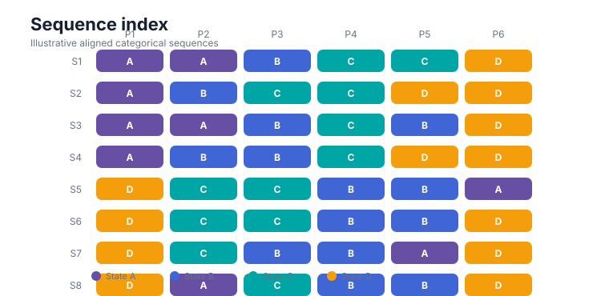
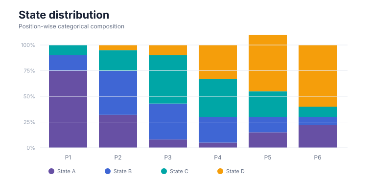
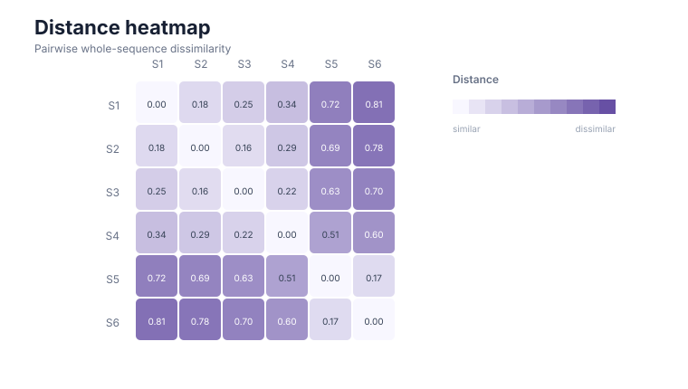
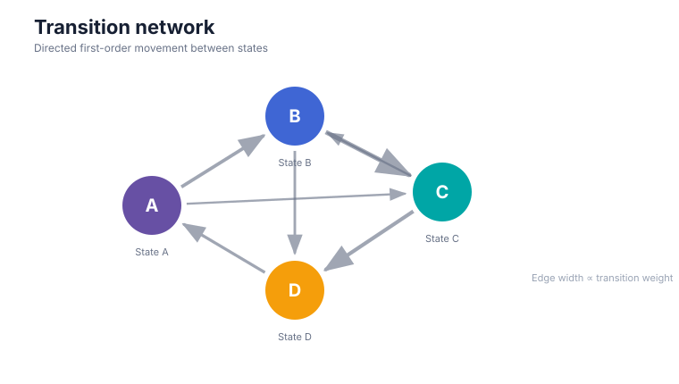

<section class="gp3-hero-v2">
  

    

      gp3sequencespy 0.1.2
      Stable · PyPI
    

    <h1>See sequence structure. Model what changes.</h1>
    

      A parity-first Python toolkit for ordered categorical sequences and scanpaths:
      audit data, discover motifs, compare trajectories, model transitions and latent
      states, test group structure, and report every analytical choice transparently.
    

    

      <a class="md-button md-button--primary" href="quickstart/">Start in 5 minutes</a>
      <a class="md-button" href="method-map/">Choose a method</a>
      <a class="gp3-text-link" href="reference/">Browse the API →</a>
    

    

      <b>81/81</b> R API counterparts
      <b>292</b> tests
      <b>100%</b> statement + branch coverage
      <b>3/3</b> mutation smoke
    

  

  

    

      

        
        <small>sequence explorer</small>
      

      

        
<b>S01</b>

        
<b>S02</b>

        
<b>S03</b>

        
<b>S04</b>

        
<b>S05</b>

      

      

        
<small>distance</small><strong>0.28</strong>

        
<small>motifs</small><strong>12</strong>

        
<small>states</small><strong>4</strong>

      

      
states → structure → evidence

    

  

</section>

  

    Install stable
    <code>pip install gp3sequencespy==0.1.2</code>
  

  

    <a href="https://pypi.org/project/gp3sequencespy/">PyPI</a>
    <a href="https://github.com/stefanosbalaskas/gp3sequencespy/releases/tag/v0.1.2">Release</a>
    <a href="https://doi.org/10.5281/zenodo.22166449">Zenodo</a>
  

<section class="gp3-section-intro">
  01
  

    
Start from the research question

    <h2>Choose the analysis by what you need to learn.</h2>
    
Move from a substantive question to an auditable method instead of starting from a function name.

  

</section>

  <a class="gp3-question-card" href="articles/sequence-data-validation-and-preparation/">
    01
✓

    <h3>Can I trust the sequence data?</h3>
Audit order, missing states, duplicated positions, duration fields, metadata, and explicit preparation policies.

    Validate &amp; prepare →
  </a>
  <a class="gp3-question-card" href="examples/">
    02
≋

    <h3>What patterns recur?</h3>
Summarise paths, occupancy, consensus, contiguous motifs, non-contiguous subsequences, and transition structure.

    Describe structure →
  </a>
  <a class="gp3-question-card" href="articles/distances-clustering-and-stability/">
    03
△

    <h3>Which sequences are similar?</h3>
Use edit, LCS, optimal-matching, or transition-profile distances, then cluster and test stability.

    Compare trajectories →
  </a>
  <a class="gp3-question-card" href="articles/transition-networks-and-higher-order-models/">
    04
↗

    <h3>How do states connect?</h3>
Build transition networks, inspect centrality and communities, fit higher-order models, and predict next states.

    Model transitions →
  </a>
  <a class="gp3-question-card" href="articles/latent-models-and-optional-adapters/">
    05
◇

    <h3>Is there latent structure?</h3>
Fit categorical, mixture, multichannel, and covariate-dependent HMM workflows with explicit convergence boundaries.

    Fit latent models →
  </a>
  <a class="gp3-question-card" href="articles/sequence-inference-and-randomization/">
    06
∴

    <h3>Do groups differ defensibly?</h3>
Declare the comparison design and use design-aware randomization rather than over-interpreting descriptive differences.

    Run inference →
  </a>

  
Not sure which route fits?<strong>Use the method map to move from question → assumptions → function family.</strong>

  <a class="md-button" href="method-map/">Open method map</a>

<section class="gp3-section-intro">
  02
  

A defensible workflow
<h2>From raw events to a reportable result.</h2>
Every stage keeps assumptions and transformations visible.

</section>

  
<b>01</b><strong>Audit</strong>integrity · order · missingness
<i>→</i>
  
<b>02</b><strong>Prepare</strong>explicit transformation policy
<i>→</i>
  
<b>03</b><strong>Describe</strong>states · paths · motifs
<i>→</i>
  
<b>04</b><strong>Compare</strong>distance · groups · stability
<i>→</i>
  
<b>05</b><strong>Model</strong>transitions · networks · HMMs
<i>→</i>
  
<b>06</b><strong>Report</strong>plots · parameters · audit trail

  

    <h3>A small API, composed into a full workflow</h3>
    
The same prepared sequence object can feed descriptive summaries, distances, networks, latent models, inference, and visualisation.

    <a class="gp3-inline-arrow" href="quickstart/">Quickstart →</a>
  

  
<pre><code class="language-python">import gp3sequencespy as g

validation = g.validate_sequence_data(data)
prepared = g.prepare_sequence_data(data)

states = g.summarise_sequence_states(prepared.data)
distance = g.compute_sequence_distance(
    prepared.data,
    method="lcs",
)
network = g.create_transition_network(
    prepared.data,
    normalise="from",
)</code></pre>

<section class="gp3-section-intro">
  03
  

See the structure
<h2>Visual outputs that stay connected to the method.</h2>
Use plots as analytical summaries, not decoration. Each gallery entry links back to the generating function and interpretation notes.

</section>

  <a href="plots/#sequence-index" class="gp3-plot-tile gp3-plot-tile--wide"><b>Sequence index</b><small>Inspect complete paths and between-sequence structure</small></a>
  <a href="plots/#state-distribution" class="gp3-plot-tile"><b>State distribution</b><small>See occupancy change over sequence position</small></a>
  <a href="plots/#distance-heatmap" class="gp3-plot-tile"><b>Distance heatmap</b><small>Inspect similarity and cluster separation</small></a>
  <a href="plots/#transition-network" class="gp3-plot-tile gp3-plot-tile--wide"><b>Transition network</b><small>Map state-to-state structure and directional flow</small></a>

<a class="md-button" href="plots/">Explore the full plot gallery</a>

<section class="gp3-section-intro">
  04
  

Evidence, not just features
<h2>Built around explicit scientific contracts.</h2>
The Python implementation is tested against a frozen R reference and exposes its translation boundaries instead of hiding them.

</section>

  

    Parity-first implementation
    <h3>Frozen behavior. Audited translation. Python-native integration.</h3>
    
<code>gp3sequencespy</code> implements the frozen <strong>gp3sequences 0.3.0</strong> public contract. Public signatures, translated test blocks, deterministic oracles, and deliberate R→Python boundaries are documented as release evidence.

    
<a href="parity/">Parity &amp; validation →</a><a href="reproducibility/">Reproducibility →</a><a href="reporting/">Reporting guide →</a>

  

  

    
<strong>81 / 81</strong>public R counterparts exported

<strong>81 / 81</strong>public signatures audited

    
<strong>130 / 130</strong>frozen R test blocks translated

<strong>15</strong>methodology articles

  

  
R→Py<h3>Coming from gp3sequences in R?</h3>
Use the translation guide to map function names, return structures, plotting conventions, and documented semantic differences.
<a href="r-to-python/">Open the R → Python guide →</a>

  
API<h3>Already know the method?</h3>
Jump directly to the frozen public API and inspect signatures, parameters, return objects, and implementation notes.
<a href="reference/api/">Browse all public functions →</a>

<section class="gp3-guardrail-v2">
  
!

  
Interpretation boundary<h2>Sequence structure is not a psychological state.</h2>
Sequence structure does not independently establish attention, cognition, emotion, comprehension, personality, intention, deception, diagnosis, or causality. Observational group contrasts remain associational unless a defensible randomized design supports causal interpretation.

</section>

<section class="gp3-final-cta">
  
Ready to analyse a sequence?<h2>Start small. Keep every decision visible.</h2>
Install 0.1.2, validate a three-column sequence table, and expand only when the research question requires it.

  
<a class="md-button md-button--primary" href="quickstart/">Open quickstart</a><a class="md-button" href="examples/">See worked examples</a>

</section>

